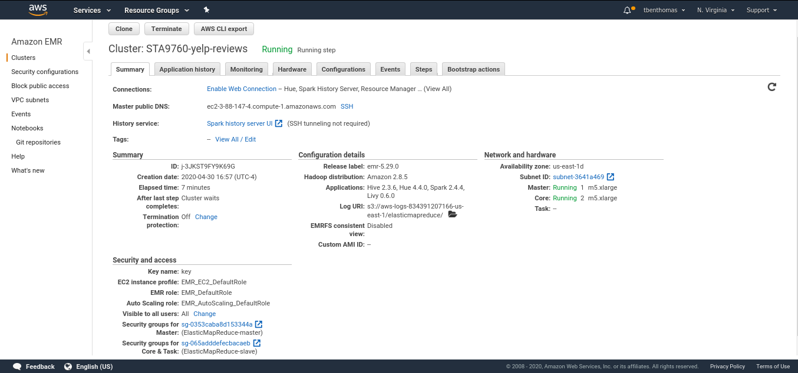
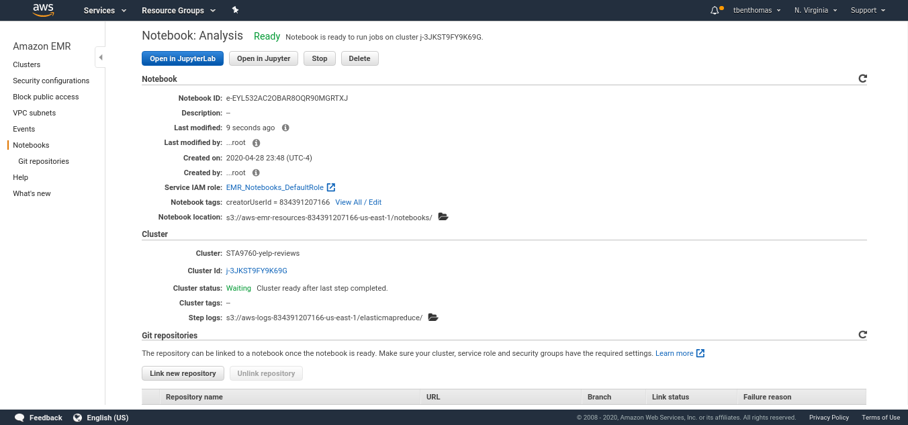

# Yelp_Analysis
Analysis of 10 GB of Yelp Reviews leveraging Pyspark and AWS EMR

This project leverages AWS EMR and a pyspark Jupyter Notebook to analyze 10 GB of Yelp Review Data. 

The data was taken from [kaggle](https://www.kaggle.com/yelp-dataset/yelp-dataset).

The notebook (Analysis.ipynb) contains an analysis of Yelp's business, review, and user data. This dataset comes from https://www.kaggle.com/yelp-dataset/yelp-dataset.

This data has been stored in a public S3 bucket 's3://yelp-reviews/data/'

# Cluster and Notebook Configs

