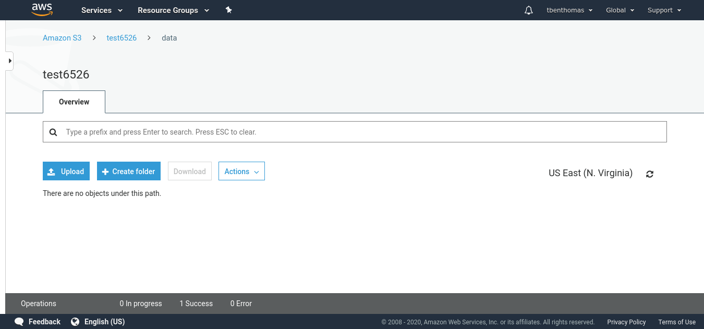
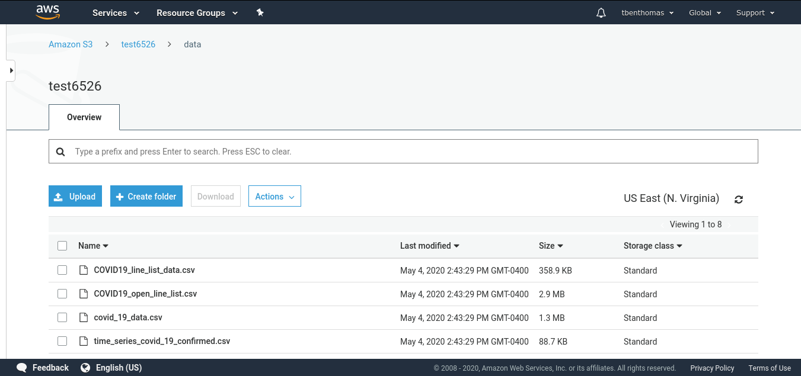

# This directory contains a Dockerfile and script to create a container to load a kaggle dataset to an S3 bucket. 

The script is called "kaggle_s3.sh"
# Docker Container
A docker container is located [here](https://hub.docker.com/repository/docker/tbenthomas/kaggle_s3/tags?page=1)
You can pull using commnad:
```
docker pull tbenthomas/kaggle_s3:1.0
```

# Usage
run: 
```
docker run -it \
-v {path to .kaggle folder}:/root/.kaggle \
-v {path to .aws folder}:/root/.aws \
tbenthomas/kaggle_s3:1.0 \
/app/kaggle_s3.sh {kaggle dataset} {s3 bucket location}
```

Required arguments are:
- Path to .kaggle folder on your local. This contains kaggle username and security key
- Path to .aws folder on your local. This contains personal security configuration for your aws account
- kaggle dataset path. This contains the path to the dataset you want to pull.
- s3 bucket location. This specifies the path of the S3 bucket location you want to load

## Example arguments (My Case).
This example uses this [kaggle dataset](https://www.kaggle.com/sudalairajkumar/novel-corona-virus-2019-dataset) 
This example also uses an s3 bucket location I created at path s3://test6526/data/

- Path to .kaggle folder on your local. ~/.kaggle
- Path to .aws folder on your local. ~/.aws
- kaggle dataset path. sudalairajkumar/novel-corona-virus-2019-dataset
- s3 bucket location. s3://test6526/data/

## Example Run
```
docker run -it \
-v ~/.kaggle:/root/.kaggle \
-v ~/.aws:/root/.aws \
tbenthomas/kaggle_s3:1.0 \
/app/kaggle_s3.sh sudalairajkumar/novel-corona-virus-2019-dataset s3://test6526/data/

```

Before running docker container:


After Running docker container:

